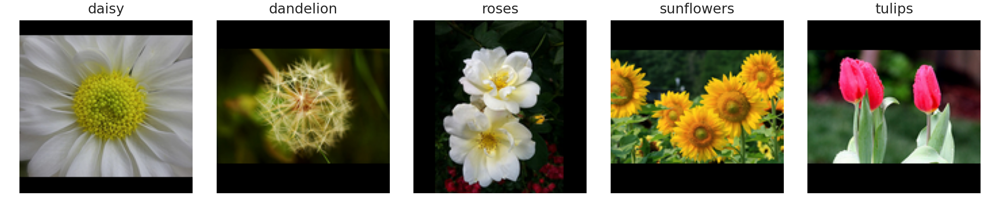
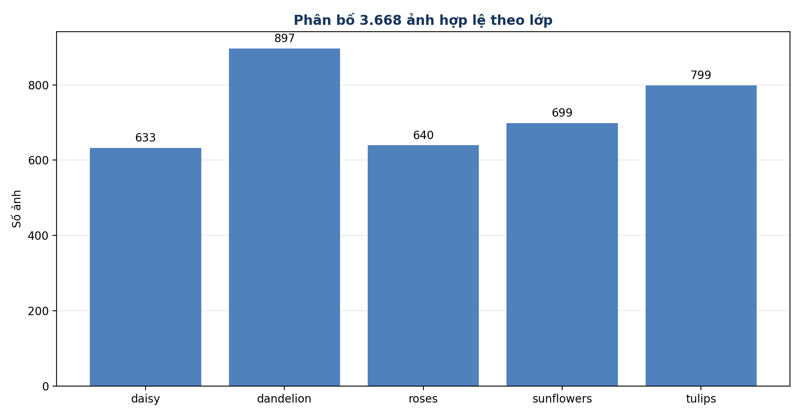
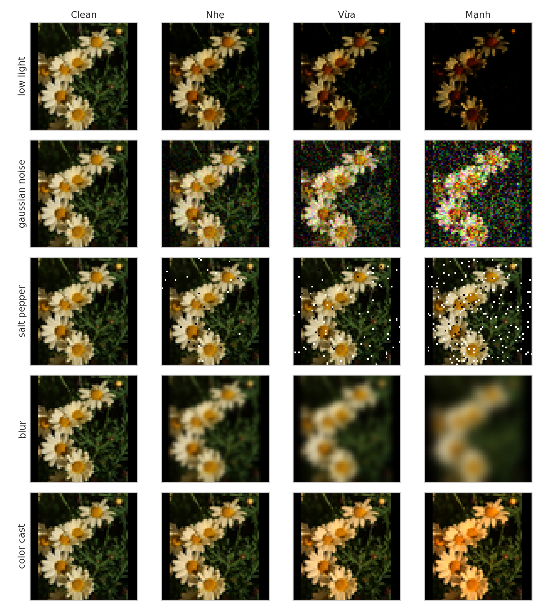
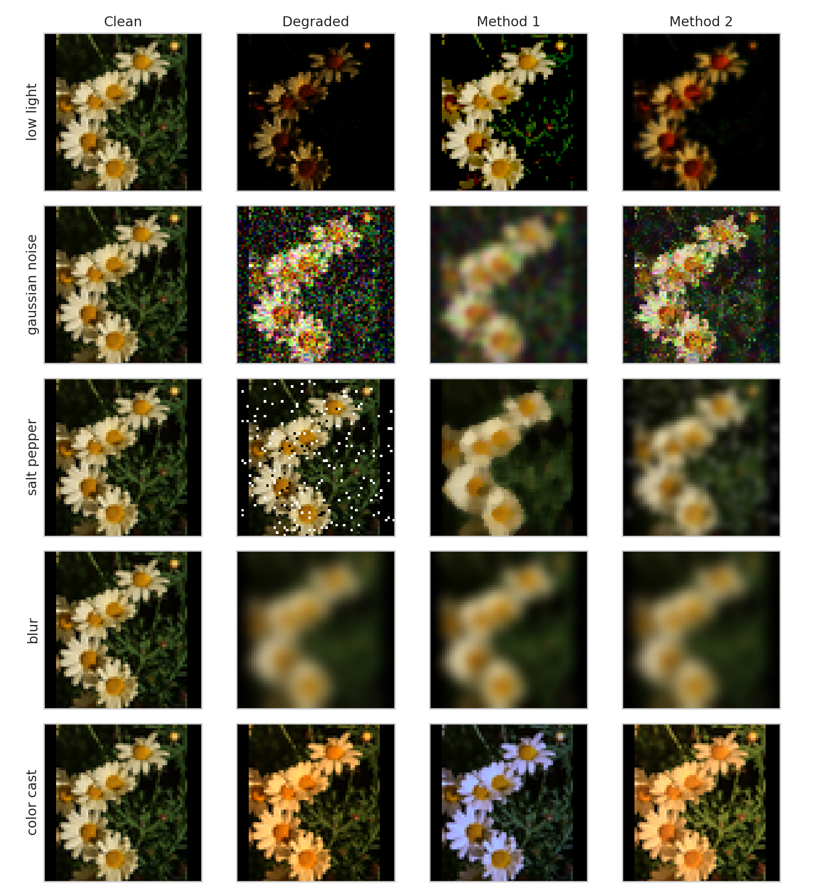
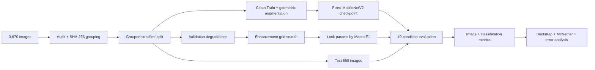
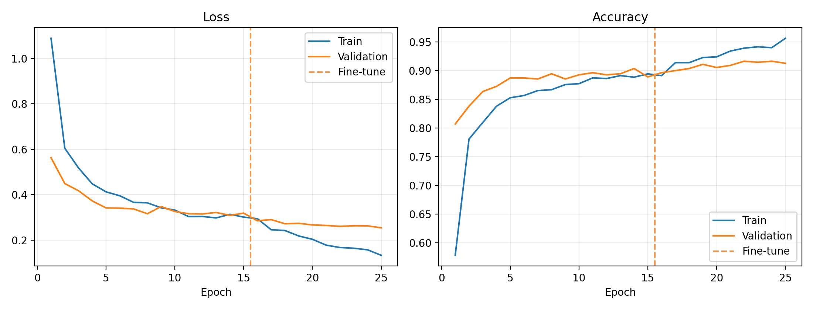
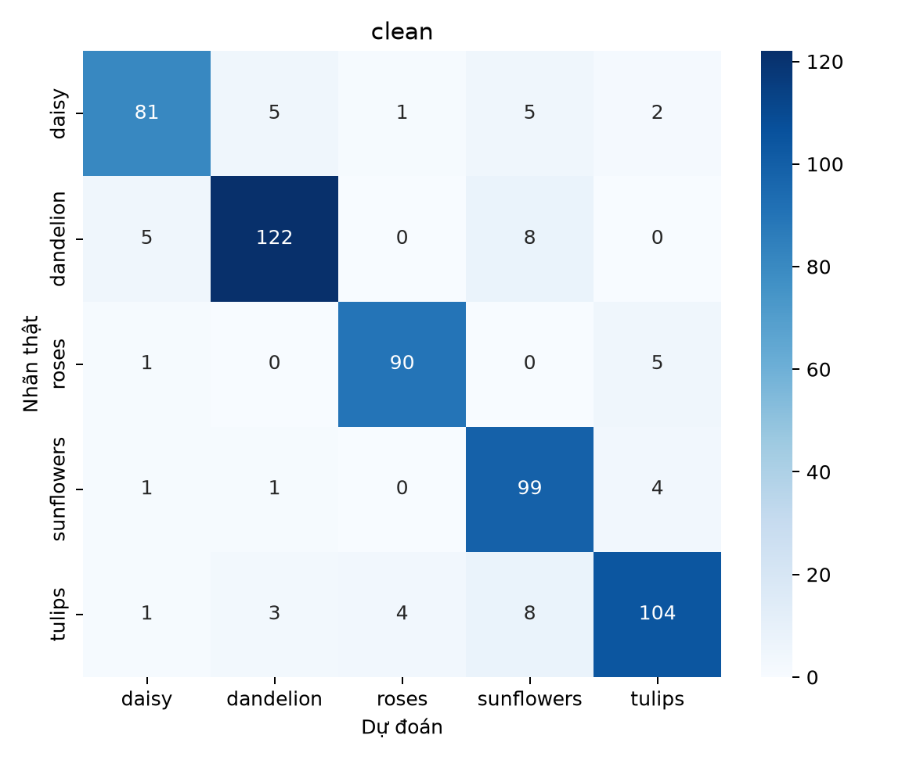
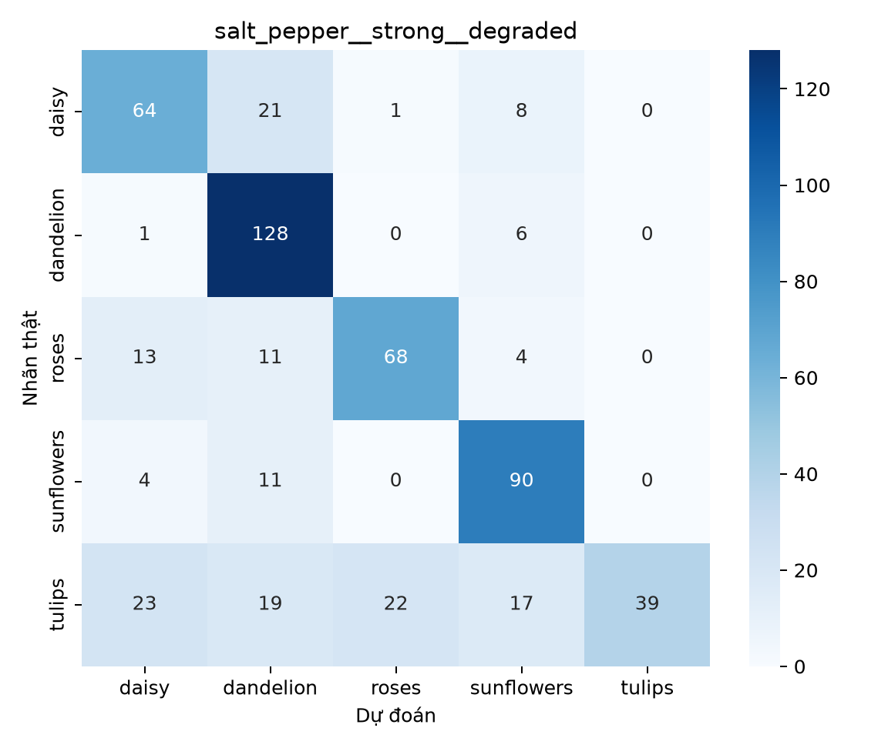
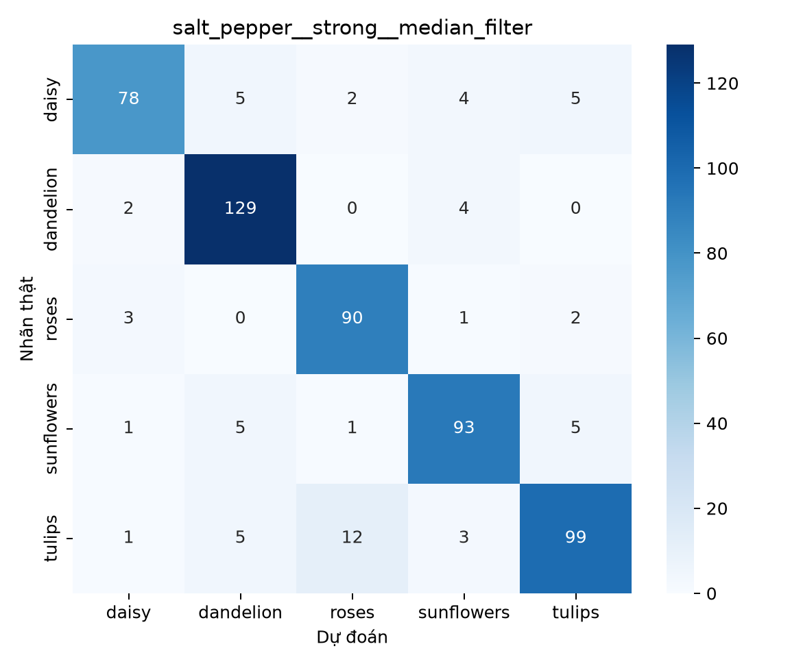

# Nhận diện 5 loại hoa dưới ảnh suy giảm — Image Restoration + MobileNetV2


> Đánh giá độ bền vững của một **MobileNetV2 cố định** khi ảnh hoa bị suy giảm, đồng thời kiểm tra liệu các kỹ thuật xử lý ảnh cổ điển có phục hồi được chất lượng ảnh và hiệu năng phân loại hay không.
## Table of Contents
- [Project Status](#project-status)
- [Bài toán và mục tiêu](#bài-toán-và-mục-tiêu)
- [Dataset](#dataset)
- [Image Degradation & Restoration](#image-degradation--restoration)
- [Experimental Methodology](#experimental-methodology)
- [MobileNetV2](#mobilenetv2)
- [Experimental Results](#experimental-results)
- [Repository Structure](#repository-structure)
- [Installation & Quick Start](#installation--quick-start)
- [Reproduce Full Experiment](#reproduce-full-experiment)
- [Streamlit Application](#streamlit-application)
- [Testing & Validation](#testing--validation)
- [Reproducibility](#reproducibility)
- [Deployment](#deployment)
- [Limitations & Future Work](#limitations--future-work)
- [Project Team, Author & License](#project-team-author--license)
## Project Status
| Hạng mục | Trạng thái hiện tại | Bằng chứng chính |
|---|---|---|
| Dataset audit | ✅ Complete | [`data/inventory.csv`](data/inventory.csv), [`artifacts/data_audit.json`](artifacts/data_audit.json) |
| Leakage-safe split | ✅ Complete | [`splits/`](splits/) |
| MobileNetV2 checkpoint | ✅ Complete | [`models/mobilenetv2_flowers.keras`](models/mobilenetv2_flowers.keras), [`models/model_metadata.json`](models/model_metadata.json) |
| Validation-only tuning | ✅ Complete | [`configs/locked_enhancement_params.json`](configs/locked_enhancement_params.json) |
| Full 49-condition evaluation | ✅ `FULL_RUN_COMPLETE` | [`artifacts/full_run_metadata.json`](artifacts/full_run_metadata.json), [`results/final/manifest.json`](results/final/manifest.json) |
| Statistical & error analysis | ✅ Complete | [`results/final/statistical_tests.csv`](results/final/statistical_tests.csv), [`results/final/error_analysis.csv`](results/final/error_analysis.csv) |
| Notebook evidence | ✅ Executed | [`BTL_XuLyAnh_NhanDienHoa.ipynb`](BTL_XuLyAnh_NhanDienHoa.ipynb) |
| Streamlit local source | ✅ Ready | [`streamlit_app.py`](streamlit_app.py) |
| Public cloud deployment | ⚠️ Not deployed | [`artifacts/EXTERNAL_BLOCKERS.md`](artifacts/EXTERNAL_BLOCKERS.md) |
**Nguồn sự thật về kết quả cuối:** `results/final/*`, `artifacts/full_run_metadata.json` và `models/model_metadata.json`. Một số tài liệu Markdown cũ được tạo trước full run vẫn còn câu chữ “pending”; chúng không được dùng để thay thế các artifact cuối có timestamp ngày 27/08/2026.
## Bài toán và mục tiêu
CNN có thể giảm độ chính xác khi ảnh bị thiếu sáng, nhiễu, mờ hoặc lệch màu. Dự án giữ **cùng một MobileNetV2** cho mọi điều kiện để biến độc lập thực sự là loại/mức suy giảm và phương pháp restoration, thay vì thay đổi classifier theo từng trường hợp.
Mục tiêu chính:
1. Audit dữ liệu, ảnh lỗi và exact duplicate trước khi chia tập.
2. Tạo split Train/Validation/Test chống leakage theo path và SHA-256.
3. Mô phỏng 5 dạng suy giảm, mỗi dạng 3 mức với seed xác định.
4. So sánh các kỹ thuật enhancement cổ điển theo mapping có cơ sở.
5. Chọn tham số **chỉ trên Validation** bằng Macro F1, sau đó khóa cấu hình.
6. Đánh giá một checkpoint MobileNetV2 trên đúng 49 điều kiện Test.
7. Đo đồng thời metric ảnh, metric phân loại, paired bootstrap, McNemar và error analysis.
8. Đóng gói pipeline thành ứng dụng Streamlit standalone có readiness gate.
## Dataset
Dự án sử dụng bộ **TensorFlow Flowers** đã được tổ chức thành 5 thư mục lớp. Raw images không được đóng gói trong repository; inventory và split đã được lưu để audit/tái lập.
| Lớp | Ảnh hợp lệ | Tỷ lệ |
|---|---:|---:|
| `daisy` | 633 | 17,25% |
| `dandelion` | 898 | 24,47% |
| `roses` | 641 | 17,47% |
| `sunflowers` | 699 | 19,05% |
| `tulips` | 799 | 21,77% |
| **Tổng** | **3.670** | **100%** |
Audit ghi nhận **3.670/3.670 ảnh giải mã hợp lệ, 0 ảnh hỏng**, 3 nhóm exact duplicate gồm 6 file và 1 nhóm duplicate khác nhãn (`roses` ↔ `tulips`). Duplicate được group bằng SHA-256 thay vì xóa tự động.
### Leakage-safe split
| Split | Số ảnh | Mục đích |
|---|---:|---|
| Train | 2.571 | Học head và fine-tuning |
| Validation | 549 | Early stopping và khóa enhancement |
| Test | 550 | Đánh giá cuối |
Cả 3 cặp Train/Validation/Test đều có **0 path overlap** và **0 SHA-256 overlap**. Degradation và augmentation chỉ được tạo sau khi split.
### Canonical preprocessing
```text
EXIF transpose → RGB uint8 → letterbox LANCZOS 224×224
→ float32 0..255 → MobileNetV2 preprocess_input trong model graph
```


## Image Degradation & Restoration
| Suy giảm | Nhẹ | Vừa | Mạnh | Enhancement candidates |
|---|---|---|---|---|
| Low light | γ=1,5 | γ=2,5 | γ=4,0 | `gamma_correction`, `clahe` |
| Gaussian noise | σ=10 | σ=25 | σ=50 | `gaussian_filter`, `bilateral_filter` |
| Salt-and-pepper | 1% | 3% | 7% | `median_filter`, `gaussian_filter` |
| Gaussian blur | 3×3 | 7×7 | 15×15 | `unsharp_mask`, `sharpening` |
| Color cast | 1,05/1/0,95 | 1,15/1/0,85 | 1,30/1/0,70 | `rgb_balance`, `hsv_correction`, `lab_correction` |
Noise dùng seed ổn định theo ảnh + degradation + level. Grid tham số được tune trên Validation; metadata khóa còn lưu metric chọn (`macro_f1`), tie-break SSIM, latency, seed, split hash và model hash.


## Experimental Methodology

### 49-condition matrix
- 1 clean baseline.
- 15 degraded conditions = 5 degradations × 3 levels.
- 33 enhanced conditions: 24 từ 4 nhóm có 2 methods và 9 từ color cast có 3 methods.
- Tổng: **49 conditions × 550 Test images = 26.950 prediction rows**.
Metric phân loại: Accuracy, Macro Precision, Macro Recall, Macro F1, Weighted F1. Metric ảnh: PSNR, SSIM, ΔE2000, brightness, RMS contrast, edge preservation và histogram distance. ΔE2000 được tính cho clean/color-cast; image metrics dùng deterministic pixel stride 4 trên lattice 56×56 của ảnh 224×224.
## MobileNetV2
- Backbone: MobileNetV2 pretrained ImageNet, `include_top=False`.
- Input: `224×224×3`; output softmax 5 lớp.
- Geometric augmentation trong graph: horizontal flip, rotation 0,05, zoom 0,10, translation 0,05.
- Head: GlobalAveragePooling2D → Dropout 0,3 → Dense softmax.
- Stage 1: freeze backbone, Adam `1e-3`, tối đa 15 epoch.
- Stage 2: mở 30 lớp cuối, giữ BatchNormalization frozen, Adam `1e-5`, tối đa 10 epoch.
- EarlyStopping `patience=4`, ReduceLROnPlateau và ModelCheckpoint cùng theo dõi `val_loss`.
Run được ghi nhận đủ **15 epoch head + 10 epoch fine-tune**. Checkpoint cuối có kích thước khoảng **20,80 MiB**, SHA-256 `54e76a3464d73672dabf823b4040ef67607c49861e2a7286ca233c138dbbc44d`; metadata ghi TensorFlow 2.21.0, CUDA 12.5.1, cuDNN 9, seed 42 và thời gian training 1.776,56 giây (~29,61 phút).

## Experimental Results
### Clean baseline
| Metric | Test result |
|---|---:|
| Accuracy | **90,18%** |
| Macro Precision | **90,36%** |
| Macro Recall | **90,25%** |
| Macro F1 | **90,20%** |
| Weighted F1 | **90,21%** |
Per-class clean F1: daisy 88,52%; dandelion 91,73%; roses 94,24%; sunflowers 88,00%; tulips 88,51%.
### Best enhancement theo từng degradation level
| Degradation | Level | F1 degraded | Best method | F1 enhanced | Δ F1 |
|---|---|---:|---|---:|---:|
| low_light | light | 91,27% | `clahe` | 90,28% | -0,99 pp |
| low_light | medium | 88,45% | `gamma_correction` | 89,29% | +0,85 pp |
| low_light | strong | 83,37% | `gamma_correction` | 88,97% | +5,60 pp |
| gaussian_noise | light | 87,66% | `bilateral_filter` | 90,17% | +2,52 pp |
| gaussian_noise | medium | 78,21% | `gaussian_filter` | 81,63% | +3,42 pp |
| gaussian_noise | strong | 57,87% | `gaussian_filter` | 69,59% | +11,72 pp |
| salt_pepper | light | 85,52% | `median_filter` | 89,70% | +4,18 pp |
| salt_pepper | medium | 76,21% | `median_filter` | 89,47% | +13,26 pp |
| salt_pepper | strong | 68,63% | `median_filter` | 88,69% | **+20,07 pp** |
| gaussian_blur | light | 89,16% | `sharpening` | 90,06% | +0,90 pp |
| gaussian_blur | medium | 88,16% | `sharpening` | 89,77% | +1,61 pp |
| gaussian_blur | strong | 79,55% | `unsharp_mask` | 83,79% | +4,24 pp |
| color_cast | light | 90,67% | `hsv_correction` | 89,90% | -0,77 pp |
| color_cast | medium | 90,00% | `hsv_correction` | 89,79% | -0,20 pp |
| color_cast | strong | 87,85% | `rgb_balance` | 89,17% | +1,32 pp |
Trong 33 enhanced conditions, **23 tăng** và **10 giảm Macro F1** so với degraded counterpart. Best enhanced method theo từng level cải thiện 12/15 mức; salt-and-pepper là nhóm hưởng lợi rõ nhất, với mức tăng trung bình của best method khoảng **+12,50 pp Macro F1**.
Condition có Macro F1 cao nhất toàn bộ ma trận là `low_light__light__degraded` = **91,27%**; thấp nhất là `gaussian_noise__strong__degraded` = **57,87%**. Việc một condition suy giảm nhẹ cao hơn clean không được diễn giải là “suy giảm làm ảnh tốt hơn”; đây chỉ là kết quả phân loại trên cùng tập Test dưới biến đổi cụ thể.
### Image quality ≠ classification quality
Kết quả cho thấy tối ưu PSNR/SSIM không đồng nghĩa tối ưu Macro F1. Ví dụ `low_light__light__gamma_correction` tăng PSNR khoảng **+25,16 dB** và SSIM **+0,127**, nhưng Macro F1 lại giảm khoảng **-1,25 pp**. Vì vậy tham số enhancement được khóa bằng Macro F1 trên Validation, không chọn bằng PSNR/SSIM trên Test.
### Statistical validation
Mỗi enhanced condition được so với degraded counterpart bằng paired bootstrap 2.000 mẫu cho Accuracy/Macro F1 và exact McNemar; 33 McNemar comparisons được hiệu chỉnh Holm. Có **7/33** enhancement có McNemar Holm-adjusted `p < 0,05`, tất cả đều là cải thiện trong run này; nổi bật gồm salt-and-pepper strong + median (+20,07 pp), salt-and-pepper medium + median (+13,26 pp), Gaussian noise strong + Gaussian filter (+11,72 pp) và Gaussian blur strong + unsharp mask (+4,24 pp).
### Error analysis
`results/final/error_analysis.csv` chứa **3.295** trường hợp được phân nhóm: 842 `recovered_by_enhancement`, 553 `harmed_by_enhancement`, 613 `always_wrong`, 690 `clean_correct_degraded_wrong`, 597 `confidence_increased_still_wrong`. Điều này cho phép phân tích cả trường hợp enhancement cứu dự đoán lẫn làm hại dự đoán.



## Repository Structure
```text
.
├── BTL_XuLyAnh_NhanDienHoa.ipynb
├── streamlit_app.py
├── src/                     # data, degradation, enhancement, model, tuning, evaluation
├── app_components/          # upload validation, readiness, standalone app pipeline
├── configs/                 # experiment, degradation matrix, locked params
├── data/                    # inventory + hướng dẫn đặt raw dataset
├── splits/                  # train / validation / test khóa
├── models/                  # MobileNetV2 checkpoint + metadata + class order
├── results/final/           # 49-condition metrics, predictions, statistics, errors, CM
├── artifacts/               # environment, training, full-run and audit evidence
├── figures/                 # EDA, degradation, enhancement, classification figures
├── tests/                   # unit/integration tests
├── scripts/                 # run full pipeline, validation, notebook, packaging
├── docs/                    # report, slides, data/model cards, deployment docs
└── .github/workflows/ci.yml # CI configuration
```
## Installation & Quick Start
Yêu cầu project: Python `>=3.10,<3.14`; `.python-version` khóa Python 3.11. GPU được khuyến nghị cho training/evaluation dài.
### Windows
```bash
python -m venv .venv
.venv\Scripts\activate
python -m pip install --upgrade pip
pip install -r requirements-dev.txt
```
### Linux / macOS / WSL2
```bash
python3 -m venv .venv
source .venv/bin/activate
python -m pip install --upgrade pip
pip install -r requirements-dev.txt
```
Raw dataset cần đặt đúng cấu trúc:
```text
data/flower_photos/{daisy,dandelion,roses,sunflowers,tulips}/
```
Kiểm tra nhanh repository và chạy app:
```bash
python scripts/validate_project.py --require-full-run
python scripts/check_consistency.py
streamlit run streamlit_app.py
```
## Reproduce Full Experiment
Checkpoint hiện đã có nên có thể tái chạy tuning + 49-condition evaluation mà không train lại:
```bash
python scripts/run_full_pipeline.py --skip-train
```
Muốn train lại từ đầu:
```bash
python scripts/run_full_pipeline.py --retrain
```
`--quick-run` chỉ dùng smoke test với tối đa 10 mẫu mỗi split và **không hợp lệ cho report metrics**. Full run hiện tại được ghi nhận `quick_run=false`, `selection_split=validation`, 49 condition rows, 26.950 prediction rows, 245 per-class rows và 66 statistical-test rows.
## Streamlit Application
```bash
streamlit run streamlit_app.py
```
Ứng dụng standalone nạp trực tiếp checkpoint, không dùng backend HTTP riêng. Tính năng hiện có:
- Một ảnh hoặc batch tối đa 20 ảnh.
- Chỉ chấp nhận JPEG/PNG, tối đa 10 MB/ảnh và giới hạn 25 triệu pixel giải nén.
- Chọn degradation, mức nhẹ/vừa/mạnh và method đúng mapping.
- Hiển thị ảnh gốc / degraded / enhanced cùng nhãn và confidence.
- Probability chart cho 5 lớp; batch có bảng kết quả và tải CSV.
- Readiness gate kiểm tra checkpoint, class order, SHA-256 và 33 locked enhancement configs trước khi cho suy luận.
Docker local:
```bash
docker build -t flower-restoration-streamlit .
docker run --rm -p 8501:8501 flower-restoration-streamlit
```
## Testing & Validation
Lệnh kiểm thử chính:
```bash
python -m pytest -q
ruff check src app_components streamlit_app.py scripts tests
python scripts/check_notebook.py --require-executed --require-full-run
python scripts/validate_project.py --require-full-run
python scripts/check_consistency.py
```
Audit khi tạo README này chạy `pytest -q` và ghi nhận **24 passed, 1 skipped, 0 failed**. Notebook hiện có 29 cell, 12 code cell đã execute, 0 error output và có marker `FULL_RUN_COMPLETE`.
CI đã được cấu hình tại [`.github/workflows/ci.yml`](.github/workflows/ci.yml) để cài dependency, lint, compile, chạy tests, validator, notebook check và Streamlit health smoke trên push/pull request; README không tuyên bố CI “passing” vì repository URL/run status chưa được cung cấp.
## Reproducibility
- Global seed: **42**.
- Class order: `daisy`, `dandelion`, `roses`, `sunflowers`, `tulips`.
- Split: grouped stratification; duplicate group bằng SHA-256.
- Noise seed: deterministic theo identifier + degradation + level.
- Enhancement selection: Validation-only, primary metric Macro F1; tie-break SSIM rồi latency.
- Test không tham gia chọn tham số.
- Model SHA-256 và Test split SHA-256 được lưu trong final manifest/full-run metadata.
- Final manifest chứa checksum của model, split, bảng kết quả và confusion matrices.
- Môi trường full run: Python 3.11.16, TensorFlow 2.21.0, Keras 3.15.1, GPU được phát hiện trong WSL2.
### Experimental artifacts
| Artifact | Path |
|---|---|
| 49-condition metrics | [`results/final/condition_metrics.csv`](results/final/condition_metrics.csv) |
| 26.950 predictions | [`results/final/predictions.csv`](results/final/predictions.csv) |
| Per-class metrics | [`results/final/per_class_metrics.csv`](results/final/per_class_metrics.csv) |
| Statistical tests | [`results/final/statistical_tests.csv`](results/final/statistical_tests.csv) |
| Error analysis | [`results/final/error_analysis.csv`](results/final/error_analysis.csv) |
| Confusion pairs | [`results/final/top_confusion_pairs.csv`](results/final/top_confusion_pairs.csv) |
| Final checksums | [`results/final/manifest.json`](results/final/manifest.json) |
| Full-run metadata | [`artifacts/full_run_metadata.json`](artifacts/full_run_metadata.json) |
| Environment | [`artifacts/environment.json`](artifacts/environment.json) |
## Deployment
Project hiện ở trạng thái **`DEPLOY_READY_BUT_NOT_DEPLOYED`**. Source Streamlit, checkpoint, locked params, Dockerfile và deployment guide đã có; chưa có public HTTPS URL, deployed commit, screenshot ẩn danh và verification artifact. Không có URL deploy giả trong README.
Hướng dẫn: [`docs/STREAMLIT_DEPLOYMENT.md`](docs/STREAMLIT_DEPLOYMENT.md). External gate còn lại: [`artifacts/EXTERNAL_BLOCKERS.md`](artifacts/EXTERNAL_BLOCKERS.md).
## Limitations & Future Work
**Limitations:** suy giảm hiện là synthetic; dataset chỉ có 5 lớp và mất cân bằng vừa; có một duplicate group khác nhãn; softmax confidence chưa calibration; letterbox padding có thể ảnh hưởng ảnh tỷ lệ cực đoan; enhancement đôi khi làm giảm F1; chưa có benchmark corruption đời thực và chưa có public deployment evidence.
**Future work:** corruption thực, motion blur/JPEG/haze, tự động nhận dạng loại-mức suy giảm, adaptive enhancement, Grad-CAM, confidence calibration, ONNX/TFLite và đánh giá trên dataset lớn hơn. Mọi mở rộng nên giữ Test cuối độc lập và báo cáo chi phí tính toán cùng độ chính xác.
## Documentation
- [`docs/DATA_CARD.md`](docs/DATA_CARD.md) — dữ liệu, duplicate, split và rủi ro.
- [`docs/MODEL_CARD.md`](docs/MODEL_CARD.md) — kiến trúc và contract của MobileNetV2; phần trạng thái evaluation trong file này được tạo trước full run.
- [`docs/EXPERIMENTS.md`](docs/EXPERIMENTS.md) — câu hỏi nghiên cứu và protocol.
- [`docs/REPORT_FINAL.pdf`](docs/REPORT_FINAL.pdf) / [`docs/REPORT_FINAL.docx`](docs/REPORT_FINAL.docx) — báo cáo.
- [`docs/SLIDES_FINAL.pptx`](docs/SLIDES_FINAL.pptx) — slide thuyết trình.
- [`docs/PHAN_CONG_NHOM.md`](docs/PHAN_CONG_NHOM.md) — phân công nhóm.
## Project Team, Author & License
### Project Team
- **24100358 — Nguyễn Tùng Dương**
- **24100065 — Trịnh Ngọc Nga**
- **24106898 — Trương Việt Thành**
- **Nhóm 7 — Giảng viên: ThS. Nguyễn Văn Sơn**
### Author
**Nguyen Tung Duong**
Copyright © 2026 Nguyen Tung Duong.
### Citation
```text
Nguyen Tung Duong. Flower Image Restoration and MobileNetV2 Robustness Evaluation, 2026.
```
### License
Source code được phân phối theo **MIT License**; xem [`LICENSE`](LICENSE). Raw dataset và pretrained ImageNet weights tuân theo điều khoản của nguồn tương ứng và không được suy diễn quyền tái phân phối từ license mã nguồn.
> Lưu ý tính nhất quán: file `LICENSE` hiện có copyright notice “Flower Image Restoration CNN contributors”, trong khi quyền tác giả được yêu cầu cho README này là **Nguyen Tung Duong**. README không sửa `LICENSE` vì phạm vi tác vụ chỉ thay `README.md`.
